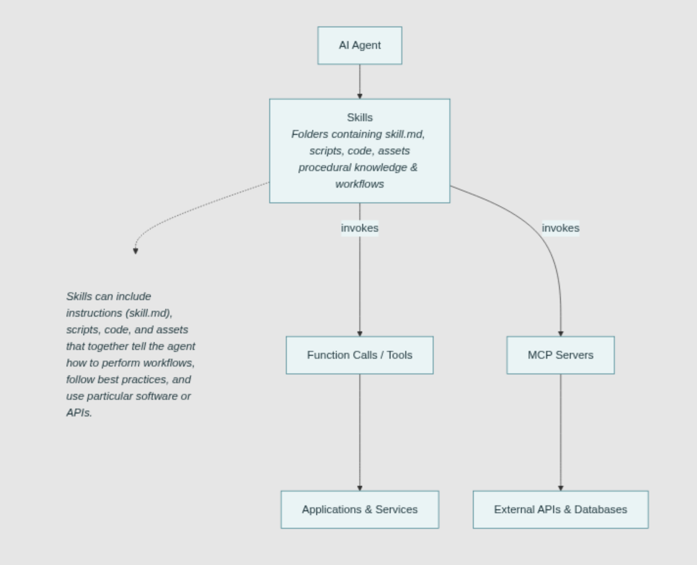

# Skills

https://t.me/neuraldeep/1796

## Overview

Claude Code, на самом деле является агентом общего назначения (general purpose agent), и многие агенты уже обладают мощным общим интеллектом, но они, как гении-теоретики им не хватает конкретной доменной экспертизы и контекста для работы «в полях».

На мой взгляд будущее не за зоопарком из "HR-агента", "Кодера" и "Юриста", а за навыками (Skills), которыми может воспользоваться любой General Agent.

По сути, навык — это просто папка (да-да, Skills are just folders ), в которой лежит:

1) Процедурное знание (docs.md / prompts) — инструкции *как* делать
2) Инструменты (script.py) — код как универсальный интерфейс для выполнения

В чем сдвиг парадигмы?
Раньше: "Мне нужен Агент-Маркетолог"
Сейчас: "Мне нужен General Agent (исполнитель), который в нужный момент подтянет навык marketing_analysis_skill".

## Diagram

